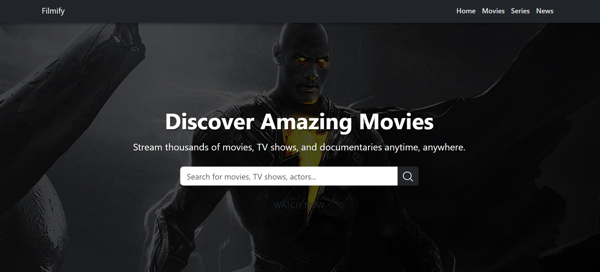

# Filmify 🎬

A modern, responsive landing page for a movies platform built with **React.js**.  
Designed to deliver a sleek and engaging experience for users looking for the latest movies, shows, and more.

## ✨ Features

- Fully responsive design (Mobile, Tablet, Desktop)
- Beautiful hero section to attract visitors
- Smooth scroll animations and transitions
- Organized components structure
- SEO-friendly and performance optimized
- Built with modular and reusable React components
- Clean and minimal UI focused on user experience

## 🚀 Tech Stack

- React.js
- HTML5 / CSS3 / JavaScript (ES6+)
- Vite for bootstrapping
- Styled Components / CSS Modules
- Bootstrap
- Font Awesome


## 📸 

> **Landing page showcasing upcoming movies, best picks, and latest releases — All with a modern cinematic feel.**

## 🛠️ Installation and Usage

```bash
# Clone the repository
git clone https://github.com/AliMohaamed/Filmify

# Navigate to the project folder
cd Filmify

# Install dependencies
npm install

# Start the development server
npm run dev


Crafted with ❤️ by Ali 
